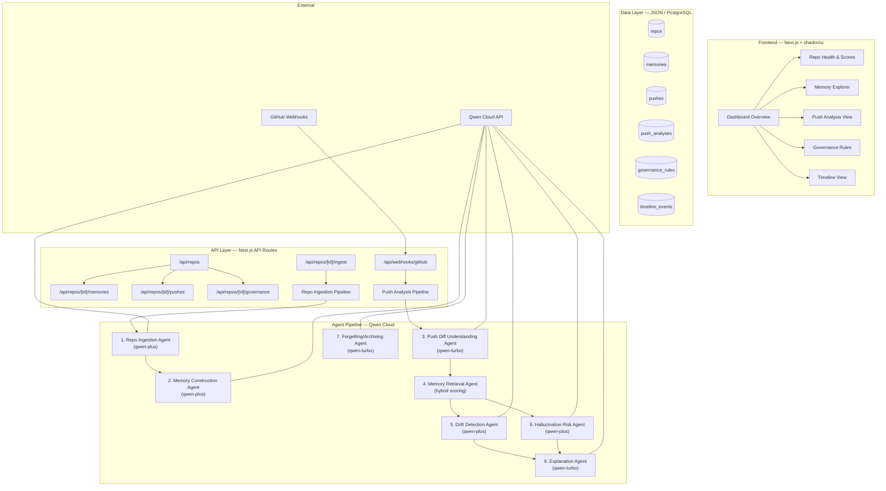

# NorthStar 🌟

*Software repos need memory, not just generation.*

NorthStar is a persistent memory agent for GitHub repositories. It remembers what a project was supposed to become, tracks every push, detects drift from the original goal, and flags hallucinated or architecture-breaking changes before they compound.

Built for the **Qwen Cloud Global AI Hackathon (Track 1: MemoryAgent)**.

## The Core Problem

Vibe-coded projects drift over time. Every new push can slowly move the repo away from its original intent, introduce inconsistent abstractions, break assumptions, or add hallucinated code that does not fit the architecture. 

Existing tools mostly review syntax, lint, tests, or style. They **do not maintain long-term memory** of the project’s mission, constraints, architecture decisions, accepted patterns, and non-goals. 

NorthStar provides that missing memory layer.

## Key Features

1. **Repo Ingestion**: Understands your project mission, tech stack, and module boundaries automatically.
2. **Persistent Memory**: Extracts and stores structured memory objects (goals, non-goals, architecture decisions, etc.).
3. **Push Analysis**: Analyzes every push against the repo's long-term memory.
4. **Drift Detection**: Flags when code starts drifting from the original product goals or architecture.
5. **Hallucination Risk**: Identifies phantom imports, disconnected abstractions, and "AI-slop" that doesn't fit the existing codebase.
6. **Smart Forgetting**: When the project intentionally pivots, NorthStar archives stale assumptions.

## Demo

Check out the MVP dashboard featuring a demo scenario of "StudyFlow", an app that goes through a good push, a bad hallucinated push, and an intentional product pivot.

## Architecture

- **Frontend & API**: Next.js 15 App Router + shadcn/ui + Tailwind CSS v4
- **Intelligence**: Qwen Cloud (`qwen-plus` for reasoning, `qwen-turbo` for classification)
- **Data**: JSON-file-based data store for the MVP (can easily swap to PostgreSQL + pgvector)

## Getting Started

1. Clone the repository
2. Run \`npm install\`
3. Copy \`.env.example\` to \`.env.local\` and add your \`QWEN_API_KEY\`
4. Run \`npm run db:seed\` to populate the demo data
5. Run \`npm run dev\` and open http://localhost:3000

## How the Agent Pipeline Works

On every push, NorthStar orchestrates an 8-agent pipeline powered by Qwen Cloud:

1. **Repo Ingestion Agent**: Generates initial project understanding
2. **Memory Construction Agent**: Structures knowledge into categorized memories
3. **Push Diff Agent**: Understands the intent behind code changes
4. **Retrieval Logic**: Ranks and pulls relevant memories based on affected files and modules
5. **Drift Detection Agent**: Compares the push against the repo's original mission and non-goals
6. **Hallucination Risk Agent**: Looks for disconnected code patterns and phantom dependencies
7. **Forgetting Agent**: Archives stale assumptions upon intentional pivots
8. **Explanation Agent**: Generates a clear, human-readable PR comment

### Drift vs. Hallucination Detection

The most novel part of this pipeline is how it distinguishes between an **intentional pivot** and **unintended drift/hallucination**. It relies on specific heuristics rather than pure LLM "vibes":

- **Drift Detection** compares the *intent* of the push against the repo's retrieved `NORTH_STAR`, `NON_GOAL`, and `ARCH_DECISION` memories. A large refactor that aligns with the core architecture is flagged as an "Intentional Pivot" (triggering the Forgetting Agent to archive old assumptions). A push that introduces features explicitly matching a `NON_GOAL` is flagged as "Drift".
- **Hallucination Detection** looks specifically for "AI slop" signals within the diff. It searches for **Phantom Imports** (importing dependencies that don't exist in `package.json`), **Disconnected Abstractions** (creating new utility classes that duplicate existing robust modules), and **Inconsistent Naming**. It does this by cross-referencing the diff against the `MODULE_ROLE` memories extracted during ingestion.

## Scalability & Production Path

Currently, NorthStar uses a local JSON file (`db.json`) as its memory and state store. 

**Why this works for the MVP:** It allows judges and users to immediately clone, seed, and run the project locally without needing to spin up external database containers or manage complex environment variables. It perfectly demonstrates the full Qwen agent loop.

**The Concrete Path to Production:** At production scale, reading/writing to a JSON file becomes a severe bottleneck, and in-memory retrieval (which currently iterates through all memories) breaks down on large repositories. The immediate upgrade path involves swapping the data layer to **PostgreSQL with `pgvector`**:
1. **Database Swaps:** The interface in `src/lib/db/index.ts` remains identical, but the implementation routes to Postgres.
2. **Retrieval Swaps:** `src/lib/agents/memory-retrieval.ts` upgrades from heuristic module-matching to a true vector similarity search using `pgvector` and DashScope's `text-embedding-v3` model. The Agent interfaces (which simply expect a `Memory[]` array) remain completely untouched.

## License

MIT License
